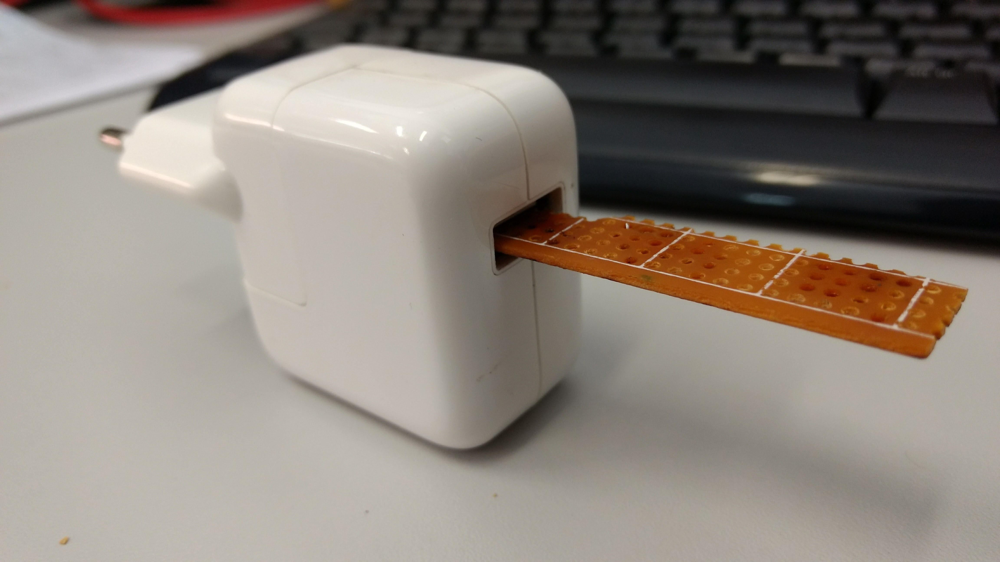

# Inspiração

Inspirado pelo trabalho de [Gordon
Williams](https://www.tindie.com/stores/gfwilliams/) o formato escolhido para a
PCB (*Printed Circuit Board* -- Placa de Circuito Impresso) integra a USB que é
usada como fonte de energia de maneira semelhante ao seu produto [Espruino Pico
ESP8266 WiFi
Shim](https://www.tindie.com/products/gfwilliams/espruino-pico-esp8266-wifi-shim/)
que é semelhante ao [USB
Blinky](https://www.theledart.com/collections/kits/products/usb-blinky-kit)
feito por [The LED Artist](https://www.theledart.com/) que já foi apresentado
como [projeto no site
Instructables.com](http://www.instructables.com/id/USB-Blinky/).

A essencia deste tipo de construção de PCB é ter uma placa base de 2mm onde o
desenho do circuito inclui um conector USB fora do padrão porém funcional,
muitas vezes utilizado quando deseja-se um produto final fino e simples. No caso
de nossa aplicação o circuito certamente será mais grosso que os 2mm da PCB,
porém ele nos esconomisa um componente, o conector USB, simplificando os
processos de aquisição e construção além de minizar o custo.

Para ajuste de espessura do conector *The LED Artist* sugere a adição de solda
na parte inferior do conector, nas duas áreas retangulades de borda arredondada
como mostrado na figura abaixo.

# Construção

Para a construção também opta-se por colar duas PCBs de 1mm para formar a
espessura pois estas são o padrão *de facto* encontrado no mercado e oferecem os
benefícios de baixo custo e possibididade de 2 camadas de circuitos (frente e
verso) sem custo adicional.

## Teste de espessura em uma USB

