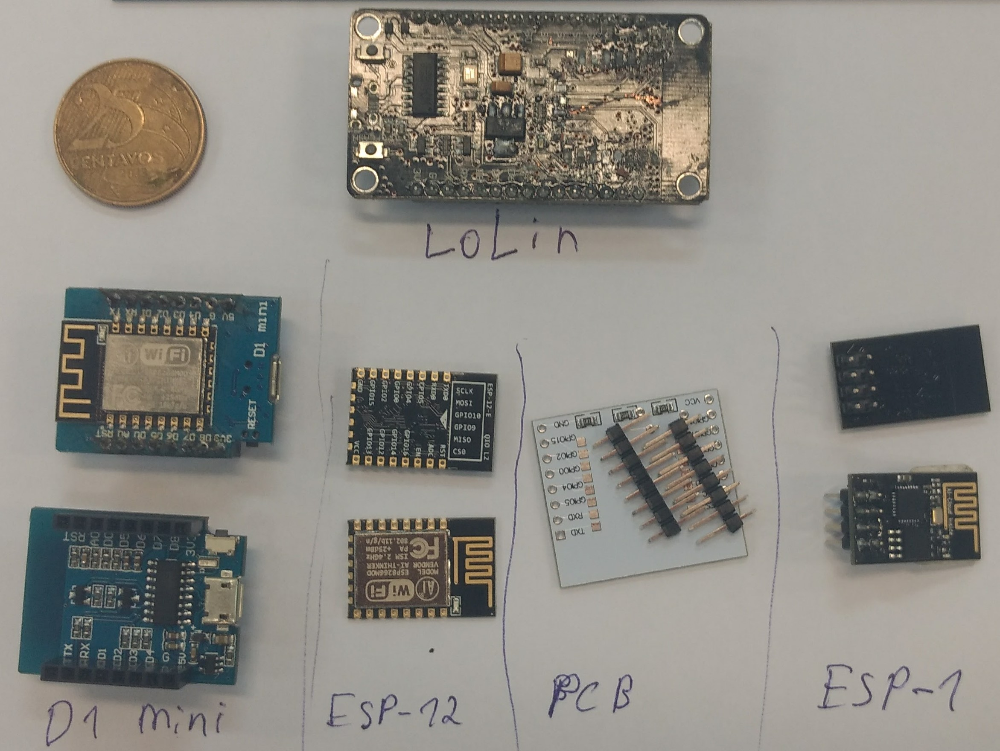
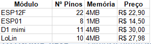

**Lista de produtos no mercado** //produtos como o seu

**Pré-construção**
Para chegar ao modelo final do sensor de dispositivos, foram testadas algumas plataformas capazes de se comunicar com o Wifi. A seguir, serão apresentadas cada uma dessas plataformas quanto as suas especificações técnicas e aos produtos utilizados em conjunto para que elas pudessem funcionar e serem programadas.

**ESP8266**
**Especificações Técnicas**
O ESP8266 é um SOC (*system on chip*), ou seja, é um chip com todos os circuitos eletrônicos necessários e partes para um dado sistema em único cirtuito integrado.

Este chip possui:
* Wifi embutido com capacidade de 2,4 GHz (802.11 b/g/n);
* 16 GPIOs (*general-purpose input/output*) - I2U, SPI, UART, entrada ADC, saída PWM;
* arquitetura RISC de 32 bits;
* CPU que opera em  80 MHz, com possibilidade de operar em 160 MHz;
* 64 KB de ROM para *boot*;
* 64 KB de RAM para instruções;
* 96 KB de RAM para dados.
* Memória Flash SPI de 512 KB.
* Núcleo baseado no IP Diamand Standard LX3 da Tensilica.

**Módulos**
Diversos fabricantes utilizam este chip com diferentes configurações, os chamados módulos. Estes módulos usam o ESP8266 com diferenças perceptíveis, por exemplo, quantidade de pinos, tamanho e alguns podem até operar de modo *standalone*. Neste trabalho, foram usados os módulos: ESP01, LoLin, D1 mini e ESP12F. A seguir, uma imagem com os módulos adquiridos e uma tabela com a descrição de cada um.

Figura X - Módulos ESP

Fonte: Elaborada pelo autor

Figura X - Descrição módulos ESP

**Primeira tentativa**
A escolha do ESP8266 como primeira tentativa está relacionada com o fato de ser um módulo Wifi de baixo custo, de tamanho reduzido e grande comunidade *open source*. No exterior, ele pode ser encontrado por $ 6,95 (Sparkfun), e no Brasil, em média, por R$ 15,00 (Mercado Livre).  Devido ao seu tamanho, ele é de fácil integração com demais dispositivos, bastando o uso de uma comunicação serial. Já sobre a comunidade, há inúmeros projetos DIY (em inglês *do it yourself*, em português "faça você mesmo") que ensinam a como construir e manipular projetos que envolvem diferentes módulos. Além disso, há empresas como a Espressif que disponibiliza no GitHub projetos com documentação e código aberto.

**Programação do módulo**
**Alimentação**
Para ligar um módulo ESP foram utilizadas formas diferentes. Quando o módulo possuía regulador de tensão *onboard*, utilizava-se o próprio conectado a uma porta USB. Quando o módulo não possuía tal, utilizava-se um circuito com fonte externa (pilhas ou USB) e um regulador de tensão conectados aos pinos 3V3 e GND. Depedendo da complexidade do circuito para ligar e ter acesso à serial do módulo, é necessário o uso de uma placa *breadboard*, como a imagem a seguir. Todo ESP precisa de um regulador de tensão de 3.3V. Para este trabalho, foi utilizado o regular AMS1117 3V3.

FOTO --> PILHA + regulador tensão + serial + breadboard

**Carregadores**
Todo código produzido em uma linguagem de programação é compilado por uma ferramenta e, então, carrega-se os arquivos binários para o ESP8266 através da serial, para que a execução do código seja iniciada. Na figura a seguir, é apresentado um modelo de caminho desde o código até chegar no módulo ESP e, também, a lista de carregadores usados.

Figura X.X - Modelo de caminho

Fonte: Elaborada pelo autor.

**Barramento Serial**
Todo código produzido é carregado para o módulo ESP através de seu barramento serial. Alguns modelos, como o LoLin e D1 mini, já apresentam conversor serial para micro USB. Para os que não possuem tal interface é necessário utilizar um conversor serial - USB. As imagens a seguir demonstram como é o acesso de alguns módulos utilizados. As GPIOs do ESP12F são acessadas somente através de placas de circuito impresso, então uma foi adquirida para a programação do mesmo.
Dos conversores serial-USB adquiridos, o modelo CH340G não funcionou por não ter driver compatível com o Windows 10, então a saída foi utilizar o modelo CP2102.

Figura X.X - Acesso ao módulo LoLin

FOTO --> serial espetado no ESP e na BreadBoard
FOTO --> ESP12 na placa de circuito impresso

**Abordagem de programação**
Os modos de programação descritos nas seções a seguir tem por objetivo acessar o ponto da API de hardware do ESP8266 onde os pacotes destinados a outros dispositivos são descartados,e habilitar o modo promíscuo.

**IDE Arduino**
A programação foi feita de primeiro modo através de um *firmware* genérico chamado AT. Este é um conjunto de instruções enviados via serial para o módulo ESP que permite configurá-lo. A IDE Arduino e o Cool Term possuem um emulador de terminal serial que aceita os comandos AT e os envia direto para a serial.Além disso, utilizou-se a linguagem C que foi compilada na IDE Arduino e enviada ao ESP.
Nenhuma dessas abordagens funcionou, pois nenhuma delas forneceu uma API que funcionasse a baixo nível suficiente para atingir o modo promíscuo do ESP, que é essencial para a descoberta de pacotes que trafegam entre dispositivos e a os APs (pontos de acesso).

FOTO ARDUINO IDE + C +comandos AT

**Toolchains**
A segunda tentativa para a programação  dos módulos escolhidos foi feita através de *toolchains* (conjunto de ferramentas para desenvolvimento de software) da empresa Espressif e de um usuário do Github, muito utilizado para projetos de ESPs, Paulo Sokolovsky (*pfalcon*). Ambas as *toolchains* são SDKs de código aberto.
Os *scripts* foram feitos na linguagem C, compilados nessas SDKs e transferidos para os módulos ESP.
O maior problema dessas SDKs foi a configuração delas. Elas requisitavam de uma versão específica do Ubuntu que a máquina utilizada para  fazer os códigos não suporta. Cogitou-se a possibilidade de fazer VMs, mas a máquina também não possui virtualização.

**Conclusão sobre o ESP**
Apesar do baixo custo e documentação da comunidade aberta, o ESP8266 não foi adotado como sensor, pois não foi possível colocá-lo em modo prosmícuo, essencial para detectar pacotes entre dispositivo e os pontos de acesso.

* Raspberry Pi 3 B plus
  * mini adaptador wifi
  * fonte 5v 2A 10W
  * cartão micro sd 16gb
